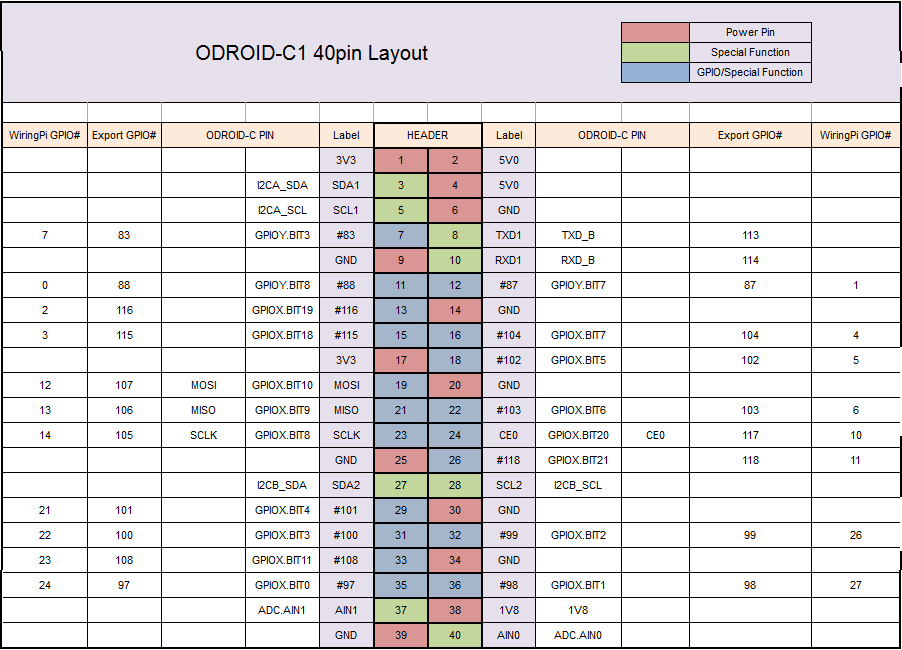

# Odroid and Inter Computer Communication Documentation

## Contents
- [Odroid Setup](#odroid-setup)
- [Using the Odroid](#using-the-odroid)
- [Odroid and ROS](#odroid-and-ros)
- [Using GPIO pins](#using-gpio-pins-on-the-odroid)
- [PWM on odroid](#pwm-on-the-odroid)
- [Setup Wifi Dongle](#setting-up-wifi-on-the-odroid-with-a-usb-dongle)
- [Setup ar_pose](#setup-arpose)

## Useful Links
- [flashing os images to sd cards](https://www.raspberrypi.org/documentation/installation/installing-images/linux.md)
- [ARM ros install](http://wiki.ros.org/indigo/Installation/UbuntuARM)
- [ROS setup shell scripts repository](https://github.com/olinrobotics/Odroid_Setup)

## Odroid Setup
There were a couple of places we had to go to setup the Odroid:

- We used the most recent image [from here](http://east.us.odroid.in/ubuntu_14.04lts/) and have tested both the minimal and lubuntu images.
- Download the image you want and extract it using: `xz -d <image_file.xz>`
  - note: I like to move the image file to another directory so I know where it is before I extract it.
- We followed [these raspberry pi instructions](https://www.raspberrypi.org/documentation/installation/installing-images/linux.md) to flash the SD card with the image. Just use the odroid image you downloaded in place of the raspian image in the instructions.
  - [these odroid instructions](http://odroid.us/mediawiki/index.php?title=Step-by-step_Ubuntu_SD_Card_Setup) specifically reference the odroid, but they have some commands that weren't working and are generally less clear.
  - If you are having problems, make sure the card has the label you think it has. Every time I have flashed an SD card, it has been in `/dev/sdx` (where x is whatever the next letter is after your hard drives)
- After following these instructions, we had to edit the `boot.ini` file to set the resolution of the connected display before we could see the image (instructions for editing the file are in comments in the file)
- After flashing the SD card, insert it in the Odroid and power it up.  If everything worked correctly, both the red power light and the blue status light will light up within a few seconds.

## Using the Odroid
There are multiple methods of getting an odroid to run the code you want it to run, and they should be chosen based on your application. (note, all of these strategies work on Raspberry Pis and other single board computers as well)

### Use the Odroid like a desktop:
Plug in a mouse, keyboard, and monitor, power up the Odroid, and use it like a normal computer.

This works perfectly well, and is usually how you test if flashing the sd card worked correctly.  You can do anything you want with it in this configuration, but it requires a lot of hardware and is therefore impractical for when the odroid is on a vehicle.

### Use SSH:
ssh is a method of opening a terminal on another computer.  It is built in for linux and mac, and can be used with a bit of messing around in Windows. This method is extremely useful because it allows you to do anything you can do from a terminal window on the odroid with only an internet connection between the two computers.

#### Find IP address
In order to ssh into the odroid, you need to know its IP address. You can do this by connecting the odroid to a network, then connecting to that network yourself, finding its IP address, and connecting, but the simpler method is to connect the odroid directly to your computer with an ethernet cable.  You then need to setup an ethernet connection on your computer to share internet to other computers (from linux):
- click on the wifi symbol in the top right
- select edit connections
- click add, then select ethernet connection
- go to `IPv4 Settings` and select `Shared to other computers` from the drop down menu
- save the connection
Now, connect an ethernet chord between your computer and the odroid, and select your new network.  Use `ifconfig` to find your IP address on the new network (should end with .0.1), then use `nmap ##.##.##.0/24` with the first three sections of the IP address you just found to find all IP address on that network.

#### SSH in
Once you know the odroid's IP address, run `ssh <username>@<ipaddress>`

By default, the username is **root** and the password is **odroid**.

You should be prompted for the odroid's password, then you should get the command prompt of the odroid.

Congratulations, you now have a terminal which is actually running commands on a different computer.

### Directly edit the SD card
The odroid stores its entire file system on an SD card. This means that you can take that SD card out of the Odroid, plug it into your computer, and edit any files you want.  You use this method to set the resolution of the monitor in the boot.ini file before the first boot up.  It is also useful for getting files onto the Odroid, and can even be the primary method of interacting with the Odroid, especially if it is set up to run your code on startup.

## Odroid and ROS
We used [these instructions](http://wiki.ros.org/indigo/Installation/UbuntuARM) to install ROS on the ODROID.  They worked fine, so you should be able to just follow them.

Once ROS is installed, you can run roscore as well as any programs which use ROS, but more setup is needed to be able to communicate with a roscore on the odroid from another computer.  We set up a [github repository](https://github.com/olinrobotics/Odroid_Setup) with some shell scripts to automatically setup the odroid to communicate with other computers.  These scripts set the `ROS_MASTER_URI` and `ROS_IP` variables to point at the correct IP address so that other computers can see the roscore running on the odroid.  Instructions for using these scripts are in that repository's README.

## Using GPIO Pins on the ODROID



### CLI

```bash
echo ${PIN} > /sys/class/gpio/export # PIN = whichever GPIO pin you decided to use
echo ${MODE} > /sys/class/gpio/gpio${PIN}/direction # MODE = 'in' or 'out'  
echo ${VALUE} > /sys/class/gpio/gpio${PIN}/value # VALUE = 1 for HIGH and 0 for LOW
echo ${PIN} > /sys/class/gpio/unexport # Done with using PIN
```

###  C/C++

See [This Github Repo](https://github.com/olinrobotics/Odroid_Setup/tree/master/gpio) for Basic C++ interface with GPIO.

For more sophisticated applications, see [This Github Repo](https://github.com/hardkernel/wiringPi).

Currently, software PWM on wiringPi doesn't work on the ODROID C1/C1+.

## PWM ON THE ODROID

ODROID HAS 2 Hardware PWM output pins, 33 and 19.

To use the PWM output module, follow the instructions below:


1. First, start the PWM module in the kernel. Specify the number of PWM pins to use.

   ```bash
   sudo modprobe pwm-meson npwm=1 #USING 1 PWM PIN (33)
   ```
   
   Alternatively, to use both pins (33 and 19), run:
   
   ```bash
   #sudo modprobe pwm-meson npwm=2 #USING 1 PWM PIN (33, 19)
   ```

2. Begin the PWM control module in the kernel.

   ```bash
   # START PWM CONTROL
   sudo modprobe pwm-ctrl
   ```

3. Change directory to avoid supplying absolute paths.

   ```bash
   # CHANGE DIRECTORY
   cd /sys/devices/platform/pwm-ctrl
   ```

4. Set your parameters.

   ```bash
   export DUTY_CYCLE=102 # 0 ~ 1023
   export FREQUENCY=1024 # IN Hz, 0 ~ 1000000
   ```

5. Launch PWM.

   ```bash
   echo ${DUTY_CYCLE} > duty0
   echo 1 > enable0
   echo ${FREQUENCY} > freq0
   ```

6. When you're done, remove the loaded modules from the kernel.

   ```bash
   sudo modprobe -r pwm-ctrl
   sudo modprobe -r pwm-meson
   ```

## Setting Up WiFi on the ODROID with a USB Dongle


1. First, install the necessary tools:

   ```bash
   sudo apt-get install wireless-tools wpasupplicant
   ```

2. Check that the ODROID recognizes the device and loads the proper driver:

   ```bash
   dmesg | tail
   ```

3. Scan for available networks to check that the device functions properly.

   ```bash
   sudo iwlist wlan0 scan
   ```

4. Configure the network interfaces. In order to access the file, you need to become root. Type the password when prompted.

   ```bash
   sudo -s
   echo -e "\nauto wlan0 \niface wlan0 inet dhcp \n\twpa-ssid OLIN-ROBOTICS\n\twpa-psk R0B0TS-RULE" >> /etc/network/interfaces
   ```

5. Configure the WPA credentials for your network.

   ```bash
   wpa_passphrase  OLIN-ROBOTICS >> /etc/wpa_supplicant/wpa_supplicant_OLIN-ROBOTICS.conf 
   ```

6. Try to connect to network with the given configuration. You should see an output with UP highlighted.

   ```bash
   sudo wpa_supplicant -B -D wext -i wlan0 -c /etc/wpa_supplicant/wpa_supplicant_OLIN-ROBOTICS.conf 
   ip link show wlan0 | grep UP
   ```
   
   Tip : if you messed up and have multiple processes running wpa_supplicant, get rid of them:

   ```bash
   ps -ef | grep  "wpa_"
   sudo kill $(pgrep -f "wpa_supplicant -B")
   ```

7. Setup IP with the router.

   ```bash
   sudo dhclient -v -r wlan0
   ```

8. Restart wlan0.

   ```bash
   sudo ifdown wlan0 && sudo ifup wlan0
   ```

9. Check network connection status.

   ```bash
   iwconfig # CHECKS WIRELESS DEVICE STATUS
   ifconfig # CHECKS GENERAL NETWORK STATUS
   ```

2. Check subnet connectivity. Your computer should be connected to OLIN-ROBOTICS, if you configured your WPA credentials with OLIN-ROBOTICS.

   ```bash
   ping <your_computer_ip>
   ```

2. Check External Network Connectivity. Disable network sharing via ethernet cable if you had it set up, to verify the connection.

   ```bash
   ping www.google.com
   ```

## Setup ARPOSE 

### Installing AR_POSE
1. If you plan on visualizing the output of ar_pose with rviz, you must fix libpcre:

   ```bash
   export lib_src="http://ports.ubuntu.com/pool/main/p/pcre3"
   mkdir -p ~/libpcre && cd ~/libpcre
   wget ${lib_src}/libpcre3-dev_8.35-7.1ubuntu1_armhf.deb
   wget ${lib_src}/libpcre3_8.35-7.1ubuntu1_armhf.deb
   wget ${lib_src}/libpcre16-3_8.35-7.1ubuntu1_armhf.deb
   wget ${lib_src}/libpcre32-3_8.35-7.1ubuntu1_armhf.deb
   wget ${lib_src}/libpcrecpp0v5_8.35-7.1ubuntu1_armhf.deb
   unset lib_src
   sudo dpkg -i *.deb
   sudo apt-get -f install
   ```

   I didn't quite test if the installation would work without error.
   If you encounter an error, run:

   ```bash
   dpkg -l | grep pcre | awk '{print $3}'
   ```

   and check that all of them start with 2.
   otherwise, remove all the packages with

   ```bash
   dpkg -l | grep pcre | awk '{print $2}' | xargs -i sudo dpkg -r {}
   ```

   and try to install again.

   If dependency problems prevent the removal of the above libraries, try running the following instead:

   ```bash
   sudo apt-get remove --purge libpcre*
   ```

   Take note of the libraries that are removed and reinstall them after you fix the package.

2. Before anything else, run:

   ```bash
   sudo apt-get update
   sudo apt-get install freeglut3-dev
   ```

   I currently don't remember where glut library was needed, so just get it at the beginning.

3. You should have installed ros and initialized your catkin workspace. Make sure you have the following:

   ```bash
   source ~/catkin_ws/devel/setup.bash
   ```

   in your ~/.bashrc, so that ROS knows where your workspace is.

   If your catkin workspace is not in your home directory, replace the path above, and any related paths hereafter, with wherever you have created your catkin workspace.

4. Download ar_tools package from the repository.

   ```bash
   rosmake rviz rosbag
   cd ~/catkin_ws/src
   git clone https://github.com/ar-tools/ar_tools.git
   ```

5. Run the script to fetch the ar marker data.

   ```bash
   roscd ar_pose/demo
   ./setup_demos
   ```

6. Install Camera Drivers.

   ```bash
   sudo apt-get install ros-indigo-libuvc*
   sudo apt-get install ros-indigo-uvc-camera
   ```

7. Build artoolkit first, to prevent errors.

   ```bash
   cd ~/catkin_ws
   catkin_make --only-pkg-with-deps artoolkit
   ```

8. In order to avoid inexplicable crashes, comment out everything related to ar_multi.

   ```bash
   roscd ar_pose
   vim CMakeLists.txt
   ```

   It should look like:
   ```
   #add_executable(ar_multi
   #	src/ar_multi.cpp
   #	src/object.cpp
   #)
   #target_link_libraries(ar_multi
   #	${catkin_LIBRARIES}
   #)
   #add_dependencies(ar_multi
   #	${PROJECT_NAME}_generate_messages_cpp
   #	${artoolkit_EXPORTED_TARGETS}
   #)
   
   install(TARGETS ar_single
     RUNTIME DESTINATION ${CATKIN_PACKAGE_BIN_DESTINATION}
   )
   
   #install(TARGETS ar_multi
   #  RUNTIME DESTINATION ${CATKIN_PACKAGE_BIN_DESTINATION}
   #)
   ```

9. Make the package with flags to remove the whitelist for artoolkit.

   ```bash
   cd ~/catkin_ws
   catkin_make -DCATKIN_WHITELIST_PACKAGES=""
   ```

### Calibrating the camera

1. Plug in your oCam to a usb port and verify the connection.

   ```bash
   dmesg | tail
   lsusb
   ls /dev/video*
   ```

   Example output:

   ```bash
   [12697.053929] wlan0: Limiting TX power to 15 (15 - 0) dBm as advertised by f8:c0:01:a1:37:45
   [14905.712196] usb 3-2: new SuperSpeed USB device number 2 using xhci_hcd
   [14905.728884] usb 3-2: LPM exit latency is zeroed, disabling LPM.
   [14905.729589] usb 3-2: New USB device found, idVendor=04b4, idProduct=00f9
   [14905.729591] usb 3-2: New USB device strings: Mfr=1, Product=2, SerialNumber=3
   [14905.729593] usb 3-2: Product: oCam-5CRO-U
   [14905.729594] usb 3-2: Manufacturer: WITHROBOT Inc.
   [14905.729595] usb 3-2: SerialNumber: SN_2736C011
   [14905.729966] uvcvideo: Found UVC 1.00 device oCam-5CRO-U (04b4:00f9)
   [14905.731167] input: oCam-5CRO-U as /devices/pci0000:00/0000:00:14.0/usb3/3-2/3-2:1.0/input/input19
   Bus 001 Device 005: ID 0a5c:5800 Broadcom Corp. BCM5880 Secure Applications Processor
   Bus 001 Device 004: ID 0c45:6709 Microdia 
   Bus 001 Device 003: ID 8087:0a2a Intel Corp. 
   Bus 001 Device 002: ID 8087:8001 Intel Corp. 
   Bus 001 Device 001: ID 1d6b:0002 Linux Foundation 2.0 root hub
   Bus 003 Device 002: ID 04b4:00f9 Cypress Semiconductor Corp. 
   Bus 003 Device 001: ID 1d6b:0003 Linux Foundation 3.0 root hub
   Bus 002 Device 001: ID 1d6b:0002 Linux Foundation 2.0 root hub
   /dev/video0
   ```

2. Install the packages for handling images over ros and camera calibration.

   ```bash
   sudo apt-get install ros-indigo-image-proc
   rosdep install image_proc
   sudo apt-get install ros-indigo-camera-calibration
   ```

3. Start roscore, and leave it running throughout this instruction.

   ```bash
   roscore
   ```

4. Begin publishing the data from the camera to ROS in a terminal.

   ```bash
   rosrun uvc_camera uvc_camera_node _device:="/dev/video0" 
   ```

5. Open another tab in your terminal (CTRL-SHIFT-T) and begin Calibrating.

   ```bash
   rosrun camera_calibration cameracalibrator.py --size 8x6 --square 0.496 image:=/image_raw camera:=/
   ```

   A small window would appear showing the camera. The window will reopen to a bigger display if you close it, but **DO NOT CLOSE THIS WINDOW**. The buttons are identified by coordinates, and the coordinates stay the same even if your window becomes larger than the original one, which makes it very difficult to find the CALIBRATE button after you gathered all your samples.

   When calibrating, it takes about 40 samples. It may take more, depending on the quality of each sample.

   To obtain a variety of samples with X,Y,Z(size) and Skew values, move the Chessboard around in different orientations.

   Calibrating on the ODROID is slow, so you might want to calibrate on your computer and only copy the camera.yaml over to the odroid (not tested).

   When enough samples are gathered, the CALIBRATE button will turn green. Press on it to view the results.

   When you're satisfied, click SAVE and COMMIT. In the first terminal, take note of the path where camera.yaml is saved.

6. Move the camera.yaml file to the default directory where ar_pose looks for:

   ```bash
   mv ~/.ros/camera_info/camera.yaml /opt/ros/indigo/share/uvc_camera/camera_calibration.yaml
   ```

   Alternatively, edit your ar_pose_single.launch file and edit the camera_info_url parameter to point to the absolute **URL** of your .yaml file.
   For instance, it may look like **file:///home/odroid/.ros/camera_info/camera.yaml**.

### Running ar_pose 

1. Open the launch configuration as follows:

   ```bash
   roscd ar_pose/launch
   vim ar_pose_single.launch
   ```

2. In ar_pose_single.launch, change camera_node to uvc_camera_node.

   Then, change the device parameter to your camera device input (e.g. /dev/video0).

   Finally, check the width and height parameters under uvc_camera_node and verify that they match the ones in the camera.yaml file.

   (camera.yaml file is the one produced by camera_calibration)

   For me, the resolution was 640x480.

3. To run ar_pose:

   ```bash
   roslaunch ar_pose ar_pose_single.launch
   ```

### If ar_pose still fails 

1. To view images over ros topic, install:

   ```bash
   sudo apt-get install ros-indigo-image-view
   ```

2. Open a terminal and launch a camera instance.

   ```bash
   export ROS_NAMESPACE=my_camera
   rosrun uvc_camera uvc_camera_node _device:="/dev/video0"_width:=${WIDTH} _height:=${HEIGHT} _camera_info_url:="file:///home/odroid/path/to/yaml/file/camera_calibration.yaml"
   ```

   Note that you have to provide the *camera_info_url* to match the path in **YOUR** odroid. The script will not run properly as written.

3. Check that the camera calibration info was properly loaded.

   ```bash
   rostopic echo /my_camera/camera_info
   verify that most of the parameters are nonzero.
   ```

4. Open up another tab in your terminal and run image_proc node.

   ```bash
   export ROS_NAMESPACE=my_camera
   rosrun image_proc image_proc image:=/image_raw
   ```

5. Open up another tab in your terminal to view the rectified image.

   ```bash
   rosrun image_view image_view image:=/my_camera/image_rect
   verify that you're getting an image.
   ```

6. To view the connections between the nodes and the topics, run:

   ```bash
   rqt_graph
   ```
